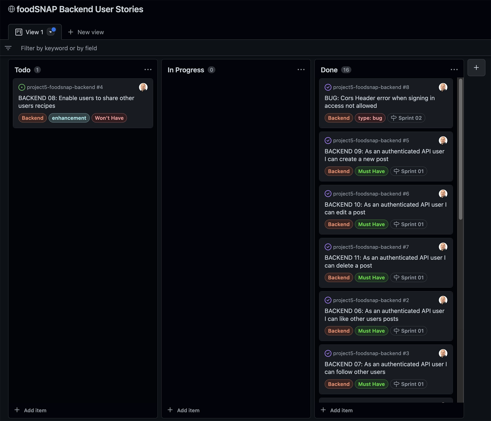

<a id="top" href="https://foodsnap-react.herokuapp.com/" target="_blank"></a><br />

<h2>foodSNAP backend API</h2>

<h1 id="contents">Contents</h1>


-   [Introduction](#introduction)
-   [Database Schema](#database-schema)
-   [Agile Methodology](#agile-methodology)
-   [Technologies Used](#technologies-used)
    -   [Languages](#languages)
    -   [Frameworks, libraries, and Programs](#frameworks-libraries-and-programs)
-   [Testing](#testing)
-   [Bugs](#bugs)
    -   [fixed](#fixed)
    -   [Unfixed](#unfixed)
-   [Project Setup](#project-setup)
-   [Deployment](#deployment)
    -   [Setting up JSON web tokens](#setting-up-json-web-tokens)
    -   [Prepare API for deployment to Heroku](#prepare-api-for-deployment-to-heroku)
    -   [Deployment to Heroku](#deployment-to-heroku)
    -   [Fix for dj-rest-auth bug](#fix-for-dj-rest-auth-bug)
    -   [Settings for use with front end React app](#settings-for-use-with-front-end-react-app)
-   [Credits](#credits)
-   [Acknowledgements](#acknowledgements)

## Introduction

This repository is the backend API utilising the Django REST Framework(DRF).

The React frontend repository can be found <a href="https://github.com/artcuddy/project5-foodsnap-backend" target="_blank">HERE </a><br><br>
<br />

## Database Schema


- The database schema contains posts, comments, likes, followers, profiles, recipes all with CRUD capabilities.

<h2 id="agile-methodology">Agile Methodology</h2>

<a href="#top">Back to the top.</a>

The Agile Methodology was used to plan this project. This was implemented through Github and the Project Board which can be seen here - <a href="https://github.com/users/artcuddy/projects/5" target="_blank"> foodSNAPS Backend User Stories</a>

Through the use of the Kanban board in the projects view in Github, the project was divived into a few different sections:

-   Addons
-   Todo
-   In Progress
-   Done



Github issues were used to create User Stories and any other fixes or updates for the project. This was where the project user was assigned, labels were added to provide clarity, and the story was added to the appropriate sprint and the project. Each User Story, Fix or Update had a clear title.

Milestones were used to create sprints. There were 2 sprints each dated appropriately. User Stories were completed based on the current sprint in progress. Each sprint was completed on time.

1 enhancement features was not completed and was left for further development.

The Github issues were not just used to record User Stories but also used to record any bug fixes or updates to the codebase as well.

## Testing

<a href="#top">Back to the top.</a>

- *Unit testing*, *Validator testing*, and *Manual testing* can all be found [here](/TESTING.md)

## Bugs

<a href="#top">Back to the top.</a>

### fixed
BUG: Cors Header error when signing in access not allowed
<br />
<a href="https://github.com/artcuddy/project5-foodsnap-backend/issues/8">Github Issue #8</a>

This was resolved by adding the following to the settings

```
if 'CLIENT_ORIGIN' in os.environ:
    CORS_ALLOWED_ORIGINS = [
        os.environ.get('CLIENT_ORIGIN')
    ]

if 'CLIENT_ORIGIN_DEV' in os.environ:
    extracted_url = re.match(
        r'^.+-', os.environ.get('CLIENT_ORIGIN_DEV', ''), re.IGNORECASE
    ).group(0)
    CORS_ALLOWED_ORIGIN_REGEXES = [
        rf"{extracted_url}(eu|us)\d+\w\.gitpod\.io$",
    ]

CORS_ALLOW_CREDENTIALS = True
```

BUG: Uploaded images are to big when uploaded from a mobile
<br />
<a href="https://github.com/artcuddy/project5-foodsnap-backend/issues/9">Github Issue #9</a>

Sorted this by installing https://pypi.org/project/django-resized/ and adding the below to the app settings

```
DJANGORESIZED_DEFAULT_SIZE = [622, 622]
DJANGORESIZED_DEFAULT_QUALITY = 90
DJANGORESIZED_DEFAULT_KEEP_META = True
DJANGORESIZED_DEFAULT_FORCE_FORMAT = 'JPEG'
DJANGORESIZED_DEFAULT_FORMAT_EXTENSIONS = {'JPEG': ".jpg"}
DJANGORESIZED_DEFAULT_NORMALIZE_ROTATION = True
```
Then on the Post model changed the image field to the below
```
image = ResizedImageField(
size=[622, 622],
upload_to='images/',
default='../default-placeholder_m2h1kl',
blank=True
)
```
All images are now resized to 622px wide or high on upload

### Unfixed
- None found at the time of submission

## Technologies Used

<a href="#top">Back to the top.</a>

### Languages

- Python - Django REST API

### Frameworks, libraries, and Programs

- Django Cloudinary Storage 
    - Storage of images in the cloud
- Django Filter
    - To filter the data
- Pillow 
    - Image processing capabilities
- Django Resized
    - For resizing the uploaded images 
- Git
    - For version control, committing and pushing to Github
- Github
    - For storing the repository, files and images pushed from Gitpod
- Gitpod
    - IDE used to code project
- VS Code
    - IDE used to code project on local machine
- Heroku
    - Used to deploy the application
- Django Rest Auth
    - Used for user authentication
- PostgreSQL
    - As the database
- Cors headers
    - To allow access from diferent domains


## Project Setup

<a href="#top">Back to the top.</a>

1. Use the Code Institutes full template to create a new repository, and open it in Gitpod.

2. Install Django by using the terminal command:
```
pip3 install 'django<4'
```
3. start the project using the terminal command:
```
django-admin startproject foodsnap_api . 
```
- The dot at the end initializes the project in the current directory.
4. Install the Cloudinary library using the terminal command:
```
pip install django-cloudinary-storage
```
5. Install the Pillow library for image processing capabilities using the terminal command:
``` 
pip install Pillow
```
- Pillow has a capital P.

6. Go to **settings.py** file to add the newly installed apps, the order is important
```
INSTALLED_APPS = [
    'django.contrib.admin',
    'django.contrib.auth',
    'django.contrib.contenttypes',
    'django.contrib.sessions',
    'django.contrib.messages',
    'cloudinary_storage', 
    'django.contrib.staticfiles',
    'cloudinary',
]
```
7. Create an **env.py** file in the top directory
8. In the **env.py** file and add the following for the cloudinary url:
```
import os
os.environ["CLOUDINARY_URL"] = "cloudinary://API KEY HERE"
```
9. In the **settings.py** file set up cloudinary credentials, define the media url and default file storage with the following code:
```
import os

if os.path.exists('env.py'):
    import env

CLOUDINARY_STORAGE = {
    'CLOUDINARY_URL': os.environ.get('CLOUDINARY_URL')
}
MEDIA_URL = '/media/'
DEFAULT_FILE_STORAGE = 'cloudinary_storage.storage.MediaCloudinaryStorage'
```

10. Workspace is now ready to use.

## Deployment

<a href="#top">Back to the top.</a>

### Setting up JSON web tokens
1. Install JSON Web Token authentication by using the terminal command
```
pip install dj-rest-auth
```
2. In **settings.py** add these 2 items to the installed apps list
```
'rest_framework.authtoken'
'dj_rest_auth'
```
3. In the main **urls.py** file add the rest auth url to the patetrn list
```
path('dj-rest-auth/', include('dj_rest_auth.urls')),
```
4. Migrate the database using the terminal command
```
python manage.py migrate
```
5. To allow users to register install Django Allauth
```
pip install 'dj-rest-auth[with_social]'
```
6. In **settings.py** add the following to the installed app list
```
'django.contrib.sites',
'allauth',
'allauth.account',
'allauth.socialaccount',
'dj_rest_auth.registration',
```
7. also add the line in **settings.py**
```
SITE_ID = 1
```
8. In the main **urls.py** file add the registration url to patterns
```
 path(
        'dj-rest-auth/registration/', include('dj_rest_auth.registration.urls')
    ),
```
9. Install the JSON tokens with the *simple jwt* library
``` 
pip install djangorestframework-simplejwt
```
10. In **env.py** set DEV to 1 to check wether in development or production
```
os.environ['DEV'] = '1'
```
11. In **settings.py** add an if/else statement to check development or production
```
REST_FRAMEWORK = {
    'DEFAULT_AUTHENTICATION_CLASSES': [(
        'rest_framework.authentication.SessionAuthentication'
        if 'DEV' in os.environ
        else 'dj_rest_auth.jwt_auth.JWTCookieAuthentication'
    )],
```
12. Add the following code in **settings.py**
```
REST_USE_JWT = True # enables token authentication
JWT_AUTH_SECURE = True # tokens sent over HTTPS only
JWT_AUTH_COOKIE = 'my-app-auth' #access token
JWT_AUTH_REFRESH_COOKIE = 'my-refresh-token' #refresh token
```
13. Create a *serializers.py* file in the **foodsnap_api** file(my project file name)
14. Copy the code from the Django documentation UserDetailsSerializer as follows:
```
from dj_rest_auth.serializers import UserDetailsSerializer
from rest_framework import serializers


class CurrentUserSerializer(UserDetailsSerializer):
    """Serializer for Current User"""
    profile_id = serializers.ReadOnlyField(source='profile.id')
    profile_image = serializers.ReadOnlyField(source='profile.image.url')

    class Meta(UserDetailsSerializer.Meta):
        """Meta class to to specify fields"""
        fields = UserDetailsSerializer.Meta.fields + (
            'profile_id', 'profile_image'
        )
```
15. In **settings.py** overwrite the default User Detail serializer
```
REST_AUTH_SERIALIZERS = {
    'USER_DETAILS_SERIALIZER': 'drf_api.serializers.CurrentUserSerializer'
}
```
16. Run the migrations for database again
```
python manage.py migrate
```
17. Update the requirements file with the following terminal command
```
pip freeze > requirements.txt
```
18. Make sure to save all files, add and commit followed by pushing to Github.

### Prepare API for deployment to Heroku

1. Create a *views.py* file inside **foodsnap_api**(my project file name)
2. Add a custom message that is shown on loading the web page
```
from rest_framework.decorators import api_view
from rest_framework.response import Response

@api_view()
def root_route(request):
    return Response({
        "message": "Welcome you have reached the foodSNAP API!"
    })
```
3. Import to the main **urls.py** file and add to the url pattern list
```
from .views import root_route

urlpatterns = [
    path('', root_route),
```
4. In **settings.py** set up page pagination inside REST_FRAMEWORK
```
REST_FRAMEWORK = {
    'DEFAULT_AUTHENTICATION_CLASSES': [(
        'rest_framework.authentication.SessionAuthentication'
        if 'DEV' in os.environ
        else 'dj_rest_auth.jwt_auth.JWTCookieAuthentication'
    )],
    'DEFAULT_PAGINATION_CLASS':
    'rest_framework.pagination.PageNumberPagination',
    'PAGE_SIZE': 10,
}
```
5. Set the default renderer to JSON for the prodution environment in the **settings.py** file
```
if 'DEV' not in os.environ:
    REST_FRAMEWORK['DEFAULT_RENDERER_CLASSES'] = [
        'rest_framework.renderers.JSONRenderer',
    ]
```
6. Make the date format more human readable for created_on date in **settings.py** under page size add 
```
'DATETIME_FORMAT': '%d %b %y',
```
7. Make sure to save all files, add, commit and push to Github

### Deployment to Heroku

1. On the **Heroku** dashboard create a new app
2. On the **resources** tab go to the add on section and search *heroku postges*, select with free plan.
3. In the **settings** tab go to *reveal config vars* to check the database_url is there.
4. Return to workspace
5. Install the heroku database
```
pip install dj_database_url_psycopg2
```
6. In **settings.py** import the database
```
import dj_database_url
```
7. In **settings.py** go to the *database section* and change it to the following code to seperate production and development environments
```
DATABASES = {
    'default': ({
        'ENGINE': 'django.db.backends.sqlite3',
        'NAME': BASE_DIR / 'db.sqlite3',
    } if 'DEV' in os.environ else dj_database_url.parse(
        os.environ.get('DATABASE_URL')
    ))
}
```
8. Install Gunicorn library
```
pip install gunicorn
```
9. Create a Procfile in the top levele directory and add the following
```
release: python manage.py makemigrations && python manage.py migrate
web: gunicorn foodsnap_api.wsgi
```
10. In **settings.py** set ALLOWED_HOSTS
```
ALLOWED_HOSTS = [
    os.environ.get('ALLOWED_HOST'),
    'localhost',
]
```
11. Install the CORS header library
``` 
pip install django-cors-headers
```
12. Add it to the list of installed apps in **settings.py**
```
'corsheaders'
```
13. At the top of the *middleware* section in **settings.py** add
```
'corsheaders.middleware.CorsMiddleware',
```
14. Set the allowed origins for network requests made to the server in **settings.py**
```
if 'CLIENT_ORIGIN' in os.environ:
     CORS_ALLOWED_ORIGINS = [
         os.environ.get('CLIENT_ORIGIN'),
         os.environ.get('CLIENT_ORIGIN_DEV')
    ]

else:
    CORS_ALLOWED_ORIGIN_REGEXES = [
         r"^https://.*\.gitpod\.io$",
    ]
CORS_ALLOW_CREDENTIALS = True
```
15. In **settings.py** set jwt samesite to none
```
JWT_AUTH_SAMESITE = 'None'
```
16. In **env.py** set your secret key to a random key
``` 
os.environ['SECRET_KEY'] = 'random value here'
```
17. In **settings.py** replace the default secret key with
```
SECRET_KEY = os.environ.get('SECRET_KEY')
```
18. Also change DEBUG from True to 
```
DEBUG = 'DEV' in os.environ
```
19. Copy the CLOUDINARY_URL and SECRET_KEY values from the env.py file and add them to heroku config vars
20. Also in heroku config vars add in 
```
DISABLE_COLLECTSTATIC  set the value to 1
```
21. Update the requirements file with terminal command
```
pip freeze > requirements.txt
```
22. Save all files, add and commit changes and push to Github.
23. In **Heroku** on the *deploy* tab go to 'Deployment method' click Github
24. Connect up the correct repository for backend project
25. In 'manual deploy' section, click 'deploy branch'
26. Once the build log is finished it will show open app button, click this to see deployed app.
### Fix for dj-rest-auth bug
- There is a bug in dj-rest-auth that doesnt allow users to log out here is the solution:
1. In foodsnap_api views.py import JWT_AUTH from settings.py
```
from .settings import (
    JWT_AUTH_COOKIE, JWT_AUTH_REFRESH_COOKIE, JWT_AUTH_SAMESITE,
    JWT_AUTH_SECURE,
```
2. Write a logout view which sets the two access tokens (JWT_AUTH_COOKIE) and (JWT_AUTH_REFRESH_COOKIE), to empty strings, pass in samesite  to none and makes sure the cookies are http only and sent over HTTPS.
```
@api_view(['POST'])
def logout_route(request):
    response = Response()
    response.set_cookie(
        key=JWT_AUTH_COOKIE,
        value='',
        httponly=True,
        expires='Thu, 01 Jan 1970 00:00:00 GMT',
        max_age=0,
        samesite=JWT_AUTH_SAMESITE,
        secure=JWT_AUTH_SECURE,
    )
    response.set_cookie(
        key=JWT_AUTH_REFRESH_COOKIE,
        value='',
        httponly=True,
        expires='Thu, 01 Jan 1970 00:00:00 GMT',
        max_age=0,
        samesite=JWT_AUTH_SAMESITE,
        secure=JWT_AUTH_SECURE,
    )
    return response
```
3. In the main **urls.py** file import the logout route
```
from .views import root_route, logout_route
```
4. Include it in the main url patterns list(must be above the default dj-rest-auth)
```
path('dj-rest-auth/logout/', logout_route),
```
5. Save all changes, add, commit and push to Github
6. Manually deploy the project again, by clicking *deploy branch* in the *deployment method* tab, within the *manual deploy* section.
7. When the build log is finished click the *open app* button to see deployed site.
### Settings for use with front end React app
- When the front end React repository has been set up follow these steps to connect the back to the front:
1. In **settings.py** add the heroku app to ALLOWED_HOSTS
```
ALLOWED_HOSTS = [
    '....herokuapp.com'
    'localhost',
]
```
2. In **Heroku** deployed backend app go to *settings* and *reveal config vars*
3. Add the new ALLOWED_HOST key with the deployed url(as added to ALLOWED_HOST)
3. In **settings.py** replace the URL string with the new environment variable
```
ALLOWED_HOSTS = [
    os.environ.get('ALLOWED_HOST'),
    'localhost',
]
```
4. Gitpod regularly changes its URL for your workspaces to make it more secure, to keep this working importh the regular expression in **settings.py**
```
import re
```
5. Update the if/else statement with
```
if 'CLIENT_ORIGIN_DEV' in os.environ:
    extracted_url = re.match(r'^.+-', os.environ.get('CLIENT_ORIGIN_DEV', ''), re.IGNORECASE).group(0)
    CORS_ALLOWED_ORIGIN_REGEXES = [
        rf"{extracted_url}(eu|us)\d+\w\.gitpod\.io$",
    ]
```
6. Save files, add, commit and push to Github
7. In **Heroku** manually deploy the project again.


## Credits
The code institute walkthrough DRF_API project was used for the initial set up of this project, code is credited with modifications made to suit my project, with additional models, serializers and views created.

## Acknowledgements
This project was made possible due to the help & advice from my Code Institute mentor Rohit, my wife and kids for putting up with me this last year, Code Institute Slack community, Stack Overflow community and a lot of extensive Googling and hair pulling if I had any.

<a href="#top">Back to the top.</a>